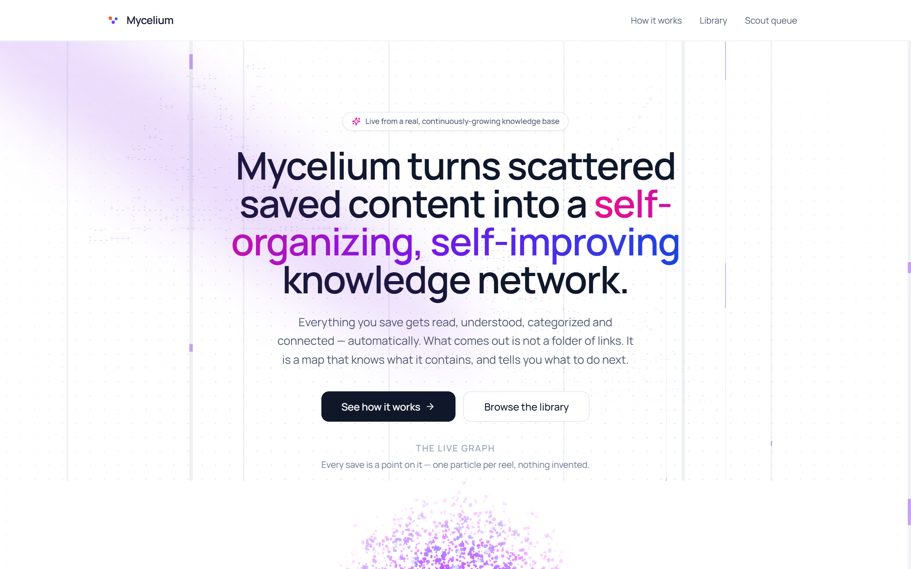
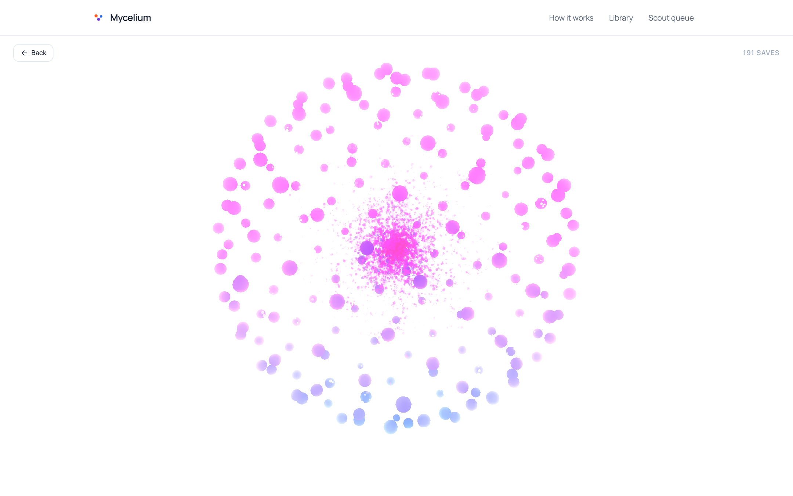
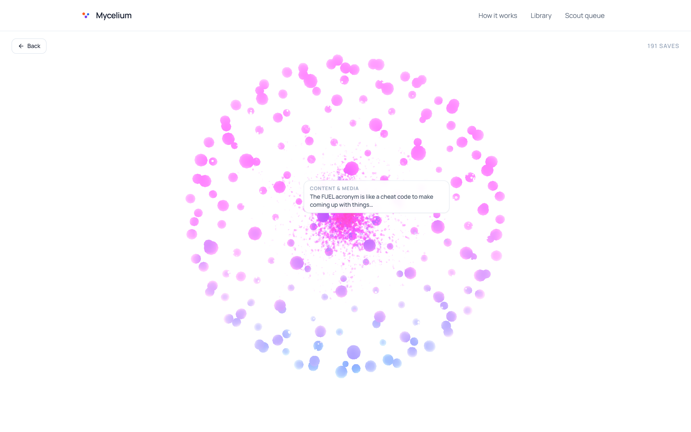
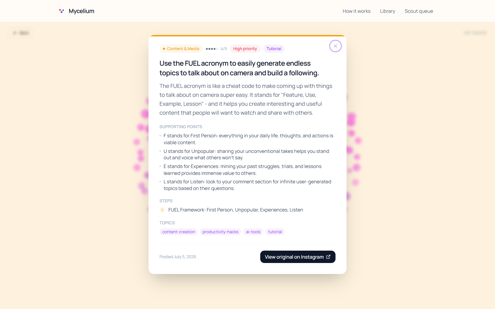
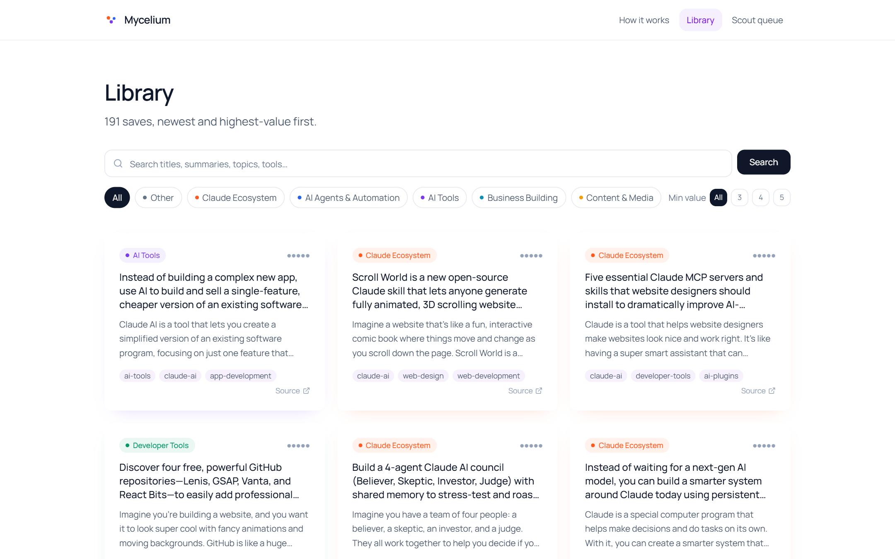
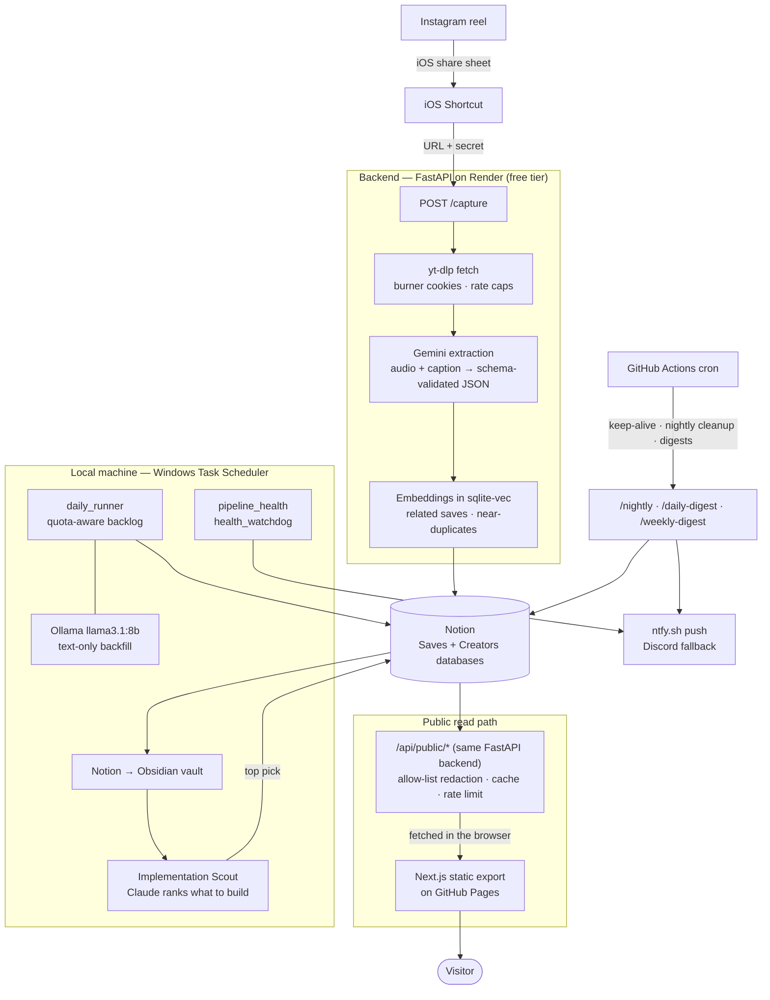

# Mycelium

**Live site → [garvbardia.github.io/reelbrain](https://garvbardia.github.io/reelbrain/)**

Mycelium is a personal automation pipeline that I run every day. Sharing an
Instagram reel from my phone starts a chain that runs by itself. The backend
downloads the reel, sends the audio and caption to Gemini, and gets back structured
notes: the main point, steps, quotes and tags. It writes those to a Notion database,
syncs them into a local Obsidian vault, and publishes a redacted, read-only copy to
the public site. The site shows every save as a point on an interactive 3D graph.
It is not a demo on sample data: the graph and library show my real saves (191 at
the time of writing), processed by the same code in this repo. It costs nothing to
run. Every service is on a free tier or runs locally, and most of the engineering
comes from working inside those free-tier limits.

<p align="center">
  
</p>

| The graph: one point per saved reel | Hovering a point shows that reel |
|---|---|
|  |  |
| **Clicking opens the full extracted note** | **The searchable library** |
|  |  |

---

## What happens to a saved reel

1. **Capture.** An iOS Shortcut on the share sheet POSTs the reel URL to the
   backend (`POST /capture`). The request is authenticated with a shared secret
   and returns `202` right away. The processing below happens after the response.
2. **Fetch.** `yt-dlp` downloads the reel with cookies from a dedicated burner
   Instagram account, never a real one. A startup guard refuses to fetch if the
   cookie file belongs to the real account. Fetches are capped per day and spaced
   out. When video download fails, it falls back to the page's caption (from its
   OpenGraph tags).
3. **Extract.** A single Gemini call takes the audio and caption and returns
   JSON matching a fixed schema: transcript, main point, supporting points, steps,
   quotes, value score, priority, content type and topic tags. Carousels and photo
   posts go through a separate image path. Text-only backfill work goes to a local
   Llama 3.1 8B model through Ollama, so it doesn't use up the Gemini free-tier quota.
4. **Store.** A Notion page is created (via Notion's 2025 data-source API) with
   the extraction, a link to the creator's record, and "related saves" found by
   embedding similarity. Embeddings are stored with `sqlite-vec`, which also
   catches near-duplicate saves.
5. **Sync.** A local job mirrors Notion into an Obsidian vault as Markdown. An
   "Implementation Scout" step reads the vault's high-priority notes, uses Claude
   to rank which ideas are worth building, and publishes the top pick back to Notion.
6. **Publish.** FastAPI serves read-only `/api/public/*` endpoints. They are
   rate-limited, cached, and filtered through an **allow-list** of fields, so a new
   private Notion property can't leak just because nobody added it to a block list.
   A static Next.js site on GitHub Pages calls those endpoints from the browser.
7. **Operate.** Scheduled jobs run nightly cleanup, daily and weekly digests, and
   a quota-aware backlog runner. Health checks stay silent when everything is fine
   and send one push notification when something breaks.

## Architecture



## The data model

Notion is the system of record. This is the real schema, read from the Notion API:

**Saves** (22 properties): `Title`, `Reel URL`, `Shortcode`, `Posted at`,
`Creator` → Creators, `Related` (self-relation, filled from embeddings),
`Topics` (multi-select, kept in line with a curated taxonomy), `Named entities`,
`Value score` (1–5), `Priority` (High/Medium/Low), `Content type`
(tutorial · insight · resource_drop · motivation · news · entertainment),
`Plain summary`, `Suggested action`, `Status` (Inbox · Awaiting DM ·
Processed/Reviewed · Failed — retry · Low signal · Gate expired · Photo — manual),
`Comment gate`, `Gate keyword`, `Gate resource`, `My note`, `Processed`,
`Created time`, `Place`.

**Creators** (7 properties): `Username`, `Full name`, `Profile URL`, `Save count`
and `Primary topics` (rollups from Saves), and `Core source`, a flag for creators
who keep producing high-value saves.

Several of these fields are private: `Gate keyword`, `Gate resource`, `My note`,
raw transcripts, and the underlying source URLs of attached resources. They
never reach the public API. The site's categories aren't stored in Notion; they
are derived from topics in `app/public_api.py`. Field-level detail is in
[DATA_SCHEMA.md](DATA_SCHEMA.md).

## Stack

| Layer | Choice |
|---|---|
| Backend | Python 3.12, FastAPI, SQLite + `sqlite-vec`, `yt-dlp`, ffmpeg |
| AI | Gemini Flash (extraction, transcription, embeddings) on the free tier, local Ollama `llama3.1:8b` for text-only backfill, Claude for the Scout step |
| Storage | Notion (system of record), Obsidian vault (local Markdown mirror) |
| Frontend | Next.js 14 static export, Tailwind, framer-motion, Three.js (instanced particles + bloom) |
| Hosting / ops | Render free tier, GitHub Pages, GitHub Actions cron, Windows Task Scheduler, ntfy.sh |
| Tests | pytest, 1,100+ tests, fully mocked (no network, no keys) |

## Running it yourself

You'll need Python 3.12, ffmpeg on `PATH`, Node 20, a Gemini API key, a Notion
integration, and **a burner Instagram account** (never use your real one).

```bash
# backend
python -m venv .venv && source .venv/bin/activate      # .venv\Scripts\activate on Windows
pip install -r requirements.txt
cp .env.example .env                                    # fill in; every variable is documented inline
python scripts/setup_notion.py                          # creates both databases; paste the IDs into .env
yt-dlp --cookies cookies.txt --dump-json <reel_url>     # confirm the burner cookies work first
uvicorn app.main:app --reload
pytest                                                  # fully mocked, no keys needed

# capture one reel end to end
curl -X POST http://localhost:8000/capture -H "Content-Type: application/json" \
  -d '{"url": "https://www.instagram.com/reel/XXXXXXXX/", "note": null, "secret": "<CAPTURE_SECRET>"}'

# frontend
cd web && cp .env.local.example .env.local && npm install && npm run dev
```

Going further, each step has its own doc:

- **Deploy the backend:** [DEPLOYMENT.md](DEPLOYMENT.md) (Render blueprint in `render.yaml`, cookies as a Secret File)
- **Deploy the frontend:** [FRONTEND_DEPLOY.md](FRONTEND_DEPLOY.md) (GitHub Pages workflow)
- **Scheduled jobs:** [SCHEDULING.md](SCHEDULING.md) (GitHub Actions) and [WORKER_SETUP.md](WORKER_SETUP.md) (local Task Scheduler)
- **iOS Shortcuts, `/attach`, phase-by-phase details, full troubleshooting table:** [docs/REFERENCE.md](docs/REFERENCE.md)
- **Obsidian vault:** [VAULT.md](VAULT.md)

## Known gotchas

These are problems I actually ran into running this, and what the code does about each.

- **The Gemini free-tier quota is the real bottleneck.** In practice it runs out
  at around 17–20 calls a day, far below the documented limit, and it blocked
  backlog work on most days early on. Three things work around it.
  `app/gemini_quota.py` keeps a local count of calls. `scripts/daily_runner.py`
  splits each day's budget across the backlog in priority order, treats a real
  `429` as the hard stop, and resumes from progress files the next day.
  Anything that doesn't need audio or images goes to local Ollama instead.
  Models have also been shut down or moved off the free tier mid-project
  (`text-embedding-004`, `gemini-2.0-flash`), so both model names are
  environment variables, not hard-coded.
- **Render's free tier sleeps.** After ~15 minutes idle, the next request takes
  ~30–50 seconds. The site shows a real loading state for this; it doesn't show a
  blank screen. A GitHub Actions cron pings `/ping` as a keep-alive, but
  scheduled Actions **don't run on time**: I've seen 1.5–3+ hour gaps against a
  10-minute schedule. Treat that keep-alive as best effort and add an external
  uptime monitor if cold starts matter to you.
- **Windows Task Scheduler can skip jobs without any error.** The nightly
  runner's task had `DisallowStartIfOnBatteries` set on a laptop. Task Scheduler
  refused to start it (Win32 error 4320) for **six days** and nothing noticed,
  because the health watchdog ran inside that same nightly task.
  `scripts/pipeline_health.py` now runs as a separate task every 4 hours with no
  battery restriction. It checks when each job's log was last written, not what
  Task Scheduler reports, because the reported status can look fine even when
  nothing ran.
- **The Instagram cookies expire, and refreshing them stays manual.** After 3
  auth failures in a row, `/health` reports `cookie_health: degraded`, and the
  nightly job posts a Notion alert and a push notification. Refreshing takes about
  two minutes ([COOKIES.md](COOKIES.md)). Automating the login would mean storing
  a real password and risking the burner account, so it's deliberately not done.
  If fetches work locally but fail on Render, Instagram is blocking datacenter
  IPs: upgrade `yt-dlp` first, then refresh the cookies.
- **Push notifications from Render get rate-limited.** ntfy.sh throttled the
  daily-digest call coming from Render's shared outbound IP, while local scripts
  were unaffected. The digest falls back to a Discord webhook when ntfy fails.
- **Notion's 2025 API change broke page creation.** Databases now contain "data
  sources", and pages must be created under a `data_source_id`. The writer and
  setup scripts target the new API, and `notion-client` is pinned to match.

## Repository layout

```
app/            FastAPI app: capture, fetch, Gemini pipeline, Notion writer, public API, jobs
scripts/        setup, backfills, daily_runner, vault sync, Scout, health checks
prompts/        versioned extraction prompt
tests/          pytest suite (mocked)
web/            Next.js frontend (static export → GitHub Pages)
docs/           detailed reference + screenshots
.github/        Pages deploy + scheduled jobs
render.yaml     Render blueprint
```

> **Naming:** the product is **Mycelium**. The Python package, Render service and
> repo keep the original codename `reelbrain`. Renaming would touch nearly every
> file and change nothing a visitor can see.
